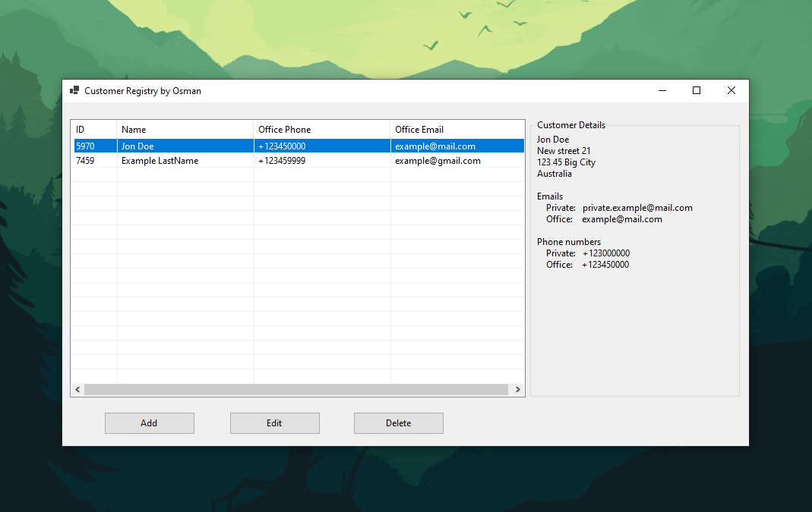
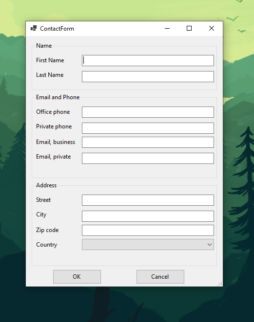

## Customer Registry Application

### Overview

The Customer Registry application is a simple Windows Forms desktop application designed to help users manage customer information. Users can add, edit, and delete customer records, each containing personal and contact details, including name, address, phone numbers, and email addresses.
### Features

- Add a new customer with detailed contact information, including address, phone numbers, and email addresses.
- Edit existing customer information.
- Delete a selected customer from the registry.
- View detailed information about a customer, including address, phone numbers, and email addresses.

### Technologies Used

- **C#**: The primary programming language used for this application.
- **.NET 8**: Utilized for building the Windows Forms application.
- **Windows Forms**: Used for designing the graphical user interface (GUI).

### Screenshots

<div style="display: flex; justify-content: space-between;">
    
    
</div>

### Classes

#### MainForm.cs
- **MainForm**: The main form of the application.

#### ContactForm.cs
- **ContactForm**: The form for adding and managing contact details.

#### Models
- **Address.cs**: Represents an address with street, city, zip code, and country.
- **Contact.cs**: Represents a contact with first name, last name, address, phone, and email.
- **Customer.cs**: Represents a customer with an ID and contact details.
- **CustomerManager.cs**: Manages the collection of customers.
- **Email.cs**: Represents email addresses for business and private use.
- **Phone.cs**: Represents phone numbers for office and private use.

### How to Run

1. **Clone the repository**:
   ```
   git clone https://github.com/Umid0vic/CustomerRegistry.git
   ```

2. **Open the solution in Visual Studio**:
   ```
   CustomerRegistry.sln
   ```

3. **Build the solution**:
   - Go to `Build` -> `Build Solution` or press `Ctrl+Shift+B`.

4. **Run the application**:
   - Press `F5` or go to `Debug` -> `Start Debugging`.
